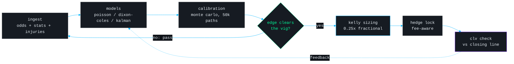

<!-- every visual on this page is a committed SVG under assets/ or GitHub-served. no third-party card services, nothing that can time out. -->

<div align="center">
  <a href="https://github.com/ThatOneSharpDude"></a>
</div>

<p align="center">
  <a href="mailto:foxcamann@gmail.com"></a>
  <a href="https://github.com/ThatOneSharpDude"></a>
  
</p>

<h3 align="center">I turn noisy data into provable edge.</h3>
<p align="center"><sub>Calibrated. Systematic. Relentless.</sub></p>

<br>

## `fox@edge:~$ whoami`

**Fox.** Quantitative sports bettor, AI automation architect, full-stack founder.
I price sports markets with real models, only bet when the number clears the vig, and grade every position against the closing line.

```diff
+ models that price the market before the market moves
+ edge detected [ok] :: hedge locked [ok] :: clv positive [ok]
- vibes, hunches, parlays    # deprecated
```

## `fox@edge:~$ htop -u fox`



| pid | process | status | what it runs |
|--:|:--|:--|:--|
| `1337` | **StateEdge** |  | US matched-betting SaaS. State x Book x Offer matrix, fee-aware hedge engine. |
| `2718` | **quant-models** |  | Poisson and Dixon-Coles for NHL, NBA, MLB, World Cup. CLV-validated. |
| `3141` | **edge-terminal** |  | Real-time +EV scanner. Books vs the sharp line, hedged on prediction markets. |
| `4242` | **jarvis** |  | Local voice-driven agentic OS. The brain runs on my machine, not the cloud. |

<sub>All four in production. F9 kills variance. It has never worked, so the models handle it instead.</sub>

## `fox@edge:~$ cat ~/quant/pipeline.mmd`



```python
# edge.config.py :: the whole philosophy in one dict
EDGE = {
    "pricing":    ["poisson", "dixon-coles"],   # goal and point distributions
    "state":      "kalman filter",              # team strength drift, tracked live
    "simulation": "monte carlo x 50_000",       # full outcome distributions, not point guesses
    "staking":    "fractional kelly (0.25x)",   # geometric growth, capped drawdown
    "validation": "closing line value",         # beat the close or it did not happen
}

assert EDGE["validation"] == "closing line value"   # no CLV, no edge, no bet
```

<details>
<summary><code>fox@edge:~$ cat sizing/kelly.py</code> <sub>:: the function that decides every stake</sub></summary>
<br>

```python
def kelly_stake(p_model: float, odds_dec: float, bankroll: float,
                fraction: float = 0.25, cap: float = 0.02) -> float:
    """Quarter-Kelly with a hard exposure cap. Edge or zero, never vibes."""
    b = odds_dec - 1.0                      # net payout per unit staked
    edge = p_model * odds_dec - 1.0         # expected value per unit
    if edge <= 0:
        return 0.0                          # no edge, no bet
    f_star = edge / b                       # full kelly fraction
    f = min(fraction * f_star, cap)         # fractional kelly, capped drawdown
    return round(bankroll * f, 2)

# >>> kelly_stake(p_model=0.52, odds_dec=2.06, bankroll=10_000)
# 167.92  :: quarter-kelly, under the 2% cap, sized to the edge
```

</details>

## `fox@edge:~$ which -a stack`

<p align="center">
  <a href="https://github.com/ThatOneSharpDude"></a>
</p>

<p align="center">
  
  
  
  
  
  
</p>

## `fox@edge:~$ tail -f telemetry.log`

<sub>Every commit is a data point. The models watch me too.</sub>


## `fox@edge:~$ ping fox`

Signal beats noise. Two channels, both monitored.

<p align="center">
  <a href="mailto:foxcamann@gmail.com"></a>
  <a href="https://github.com/ThatOneSharpDude"></a>
</p>

<br>

<div align="center">
  
</div>
