<!-- ════════════════════ ThatOneSharpDude · profile README ════════════════════ -->

<!-- WAVING NEON HEADER -->


<!-- TYPING SVG -->
<div align="center">
  <a href="https://github.com/ThatOneSharpDude">
    
  </a>
</div>

<!-- STATUS BADGES -->
<div align="center">
  
  
  
  
</div>

<br/>

<!-- ./whoami -->
<table>
<tr>
<td width="58%" valign="top">

```python
class Fox:
    def __init__(self):
        self.role      = ["quant bettor", "automation architect", "founder"]
        self.stack     = ["Python", "TypeScript", "Next.js", "Postgres"]
        self.models    = ["Poisson", "Dixon-Coles", "Kalman", "Kelly"]
        self.obsession = "provable edge (CLV > 0, calibrated)"
        self.coffee    = float("inf")

    def ship(self) -> str:
        while not self.perfect():     # it is never perfect
            self.iterate()            # so I never stop
        return "edge, banked."        # unreachable, on purpose
```

</td>
<td width="42%" valign="top">

```yaml
> loading operator.profile ...
------------------------------
  name     : Fox
  class    : builder / quant
  builds   : models | pipelines | SaaS
  weapon   : data + automation
  timezone : always shipping
------------------------------
> edge detected  [ok]
> hedge locked   [ok]
> _
```

</td>
</tr>
</table>

<!-- TECH ARSENAL -->
### `~/ tech-arsenal`

<div align="center">


<br/><br/>


</div>

<!-- GITHUB STATS -->
### `~/ telemetry`

<div align="center">
  
  
</div>

<div align="center">
  
  
</div>

<!-- DEEP TELEMETRY: PROFILE SUMMARY CARDS -->
### `~/ deep-telemetry`

<div align="center">
  
</div>

<div align="center">
  
  
</div>

<div align="center">
  
  
</div>

<!-- 3D ISOMETRIC CONTRIBUTION CALENDAR (lowlighter/metrics) -->
### `~/ isometric-calendar`

<div align="center">
  
</div>

<!-- ACTIVITY GRAPH -->
### `~/ contribution-pulse`

<div align="center">
  
</div>

<!-- CONTRIBUTION SNAKE -->
<div align="center">
  <picture>
    <source media="(prefers-color-scheme: dark)" srcset="https://raw.githubusercontent.com/ThatOneSharpDude/ThatOneSharpDude/output/snake-dark.svg" />
    <source media="(prefers-color-scheme: light)" srcset="https://raw.githubusercontent.com/ThatOneSharpDude/ThatOneSharpDude/output/snake.svg" />
    
  </picture>
</div>

<!-- WHAT I'M BUILDING -->
### `~/ currently-engineering`

```diff
+ StateEdge        a US matched-betting SaaS: State x Book x Offer matrix + fee-aware hedge engine
+ quant-models     Poisson / Dixon-Coles models for NHL, NBA, MLB, World Cup (CLV-validated)
+ edge-terminal    real-time +EV scanner: books vs the sharp line, hedged on prediction markets
+ jarvis           a local, voice-driven agentic OS (the brain runs on my machine, not the cloud)
! always           more pipelines, more automation, more edge
```

<!-- DEV QUOTE -->
<div align="center">
  
</div>

<!-- CONNECT -->
### `~/ connect`

<div align="center">
  <a href="mailto:foxcamann@gmail.com"></a>
  <a href="https://github.com/ThatOneSharpDude"></a>
</div>

<!-- FOOTER -->

